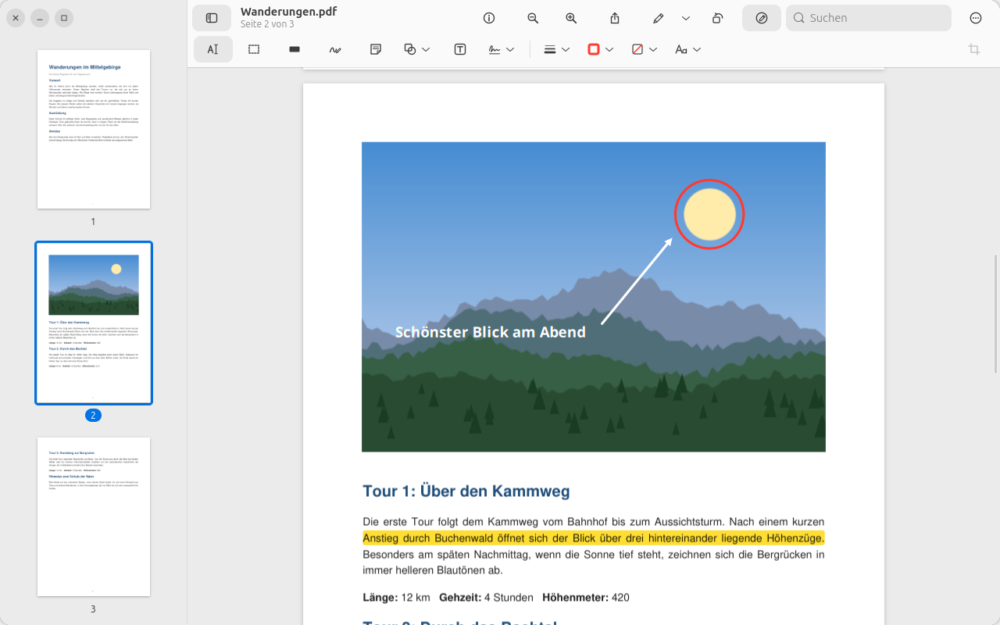
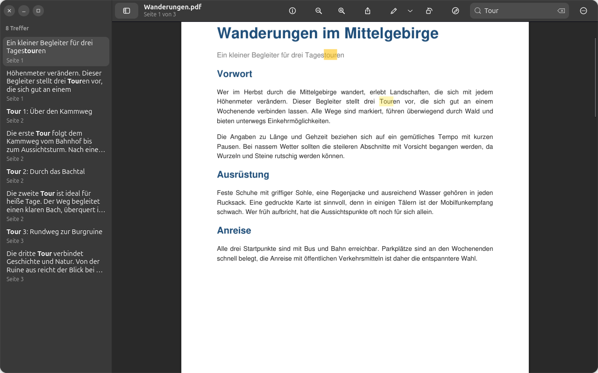
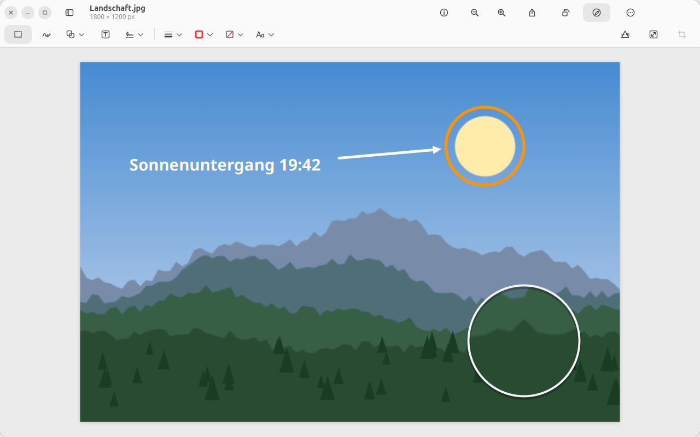
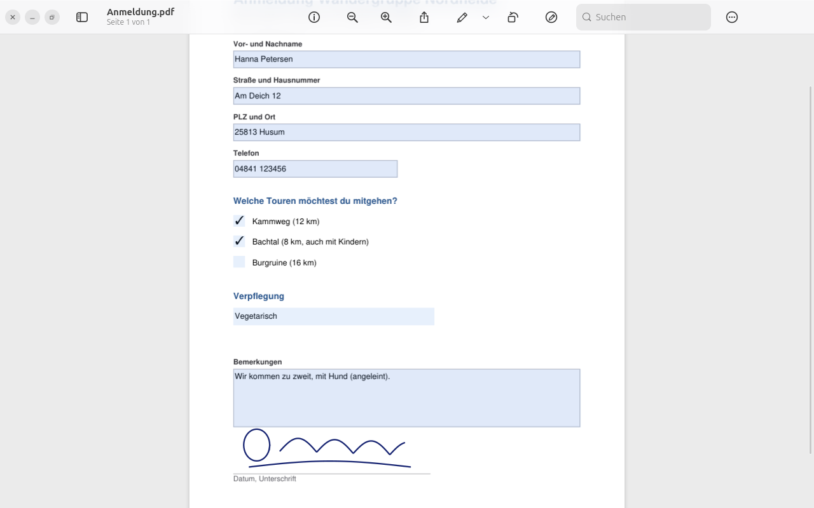
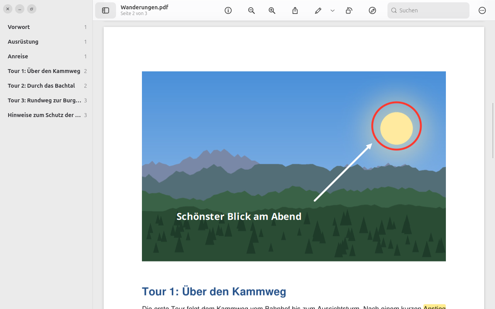

<p align="center">
  
</p>

<h1 align="center">Prevux</h1>

<p align="center">
  <b>The image and PDF viewer for people coming from the Mac.</b><br>
  Version 1.0 · GTK 4 / libadwaita · works completely offline<br>
  <a href="https://lisoft.goip.de/prevux/">lisoft.goip.de/prevux</a>
</p>



## The idea: a bridge from macOS

On the Mac, *Preview* is one of those apps people rarely talk about and badly
miss once it is gone. It opens images and PDFs instantly, lets you highlight,
sign, annotate, crop and rearrange pages, and it does all of this without
asking for an account or a subscription. For many people it is a real reason
to stay on macOS.

Prevux wants to take that reason away. It follows the look and behaviour of
Preview as closely as Linux allows — the same toolbar layout, the same markup
tools, the same keyboard shortcuts (with <kbd>Ctrl</kbd> instead of
<kbd>⌘</kbd>) and the same wording in the menus — so that switching from the
Mac to Linux feels like coming home rather than starting over. The design
follows Apple's Human Interface Guidelines where they fit a Linux desktop;
all symbols are Prevux' own, and it uses the fonts of your system.

## Privacy first

Prevux is built to keep your documents yours:

- **No network access.** Prevux does not contain any code that connects to
  the internet — no telemetry, no analytics, no crash reports, no update
  checks, no accounts, no cloud.
- **Your files stay where they are.** Documents are only read from and
  written to the places you choose. Sharing uses your system's own app
  chooser; Prevux itself uploads nothing.
- **Very little is stored.** Besides your documents, Prevux keeps only your
  saved signatures (`~/.local/share/prevux/signatures.json`, readable by you
  alone) and adds opened files to the desktop's usual *Recent files* list.
- **Redaction means removal.** Redacted text, graphics and image pixels are
  deleted from the PDF when you save, not just covered by a black box.
- **Open source.** Every line can be read and checked in this repository.

## Features

- **Images and PDFs** in one window, several documents side by side in the
  sidebar
- **Continuous scrolling** through PDF pages; zoom with <kbd>Ctrl</kbd> +
  scroll wheel or a touchpad pinch
- **Markup toolbar** like in Preview: text selection, rectangular selection,
  sketch with shape recognition, shapes (line, arrow, rectangle, oval, speech
  bubble, star, polygon, spotlight, loupe), text boxes, notes, signatures,
  shape style, border and fill color, text style
- **Highlight, underline and strike through** text in PDFs
- **Redact** text and areas in PDFs
- **Fill in PDF forms**: text fields (<kbd>Tab</kbd> moves to the next one),
  check boxes, radio buttons and choice lists
- Markup stays **editable**: in PDFs it is saved as standard annotations that
  other viewers show as well, and Prevux can edit them again later
- **Pages**: rotate, reorder by drag and drop, insert blank pages, delete;
  drag thumbnails onto another PDF (also in another window) to copy pages
- **Sidebar** with thumbnails, table of contents or search results
- **Images**: crop, rotate, flip, adjust size, adjust color
- Undo/redo for everything, search, print, export to other formats
- Light and dark mode following the system

| | |
|---|---|
|  |  |
| Search results in the sidebar, dark mode | Loupe, shapes and text on a photo |
|  |  |
| Filling in PDF forms | Table of contents |

## Status: 1.0

Prevux is feature-complete for everyday use and is the default viewer for
images and PDFs on its developer's machine. The user interface speaks
**English, German and French** – like the system, or chosen under
Settings → General → Language. Russian is planned.

Please report problems and ideas in the
[issue tracker](https://github.com/veritasX1/prevux/issues).

## Installing

Prevux needs GTK 4, libadwaita (≥ 1.8) and PyGObject from the system. It is
developed and tested on Ubuntu 26.04 LTS:

```sh
sudo apt install python3-gi gir1.2-gtk-4.0 gir1.2-adw-1
git clone https://github.com/veritasX1/prevux.git
cd prevux
./install.sh
```

Optional, for **Live Text** (select, copy and search text in photos and scanned PDFs –
recognised on your computer, nothing is uploaded):

```sh
sudo apt install tesseract-ocr tesseract-ocr-deu
```

`install.sh` sets up a virtual environment, a `prevux` command in
`~/.local/bin` and a launcher with icon in the app menu, so Prevux also shows
up under *Open With* for PDFs and images. To make it the default viewer:

```sh
xdg-mime default io.github.veritasx1.Prevux.desktop application/pdf image/png image/jpeg image/webp image/tiff image/gif image/bmp
```

To run it without installing: `.venv/bin/python main.py [FILES…]`.

## Keyboard shortcuts

Shortcuts follow Preview, with <kbd>⌘</kbd> mapped to <kbd>Ctrl</kbd> and
<kbd>⌥</kbd> to <kbd>Alt</kbd>:

| Action | Shortcut |
|---|---|
| Open / Save / Export | <kbd>Ctrl</kbd>+<kbd>O</kbd> / <kbd>Ctrl</kbd>+<kbd>S</kbd> / <kbd>Ctrl</kbd>+<kbd>Shift</kbd>+<kbd>S</kbd> |
| Show markup toolbar | <kbd>Ctrl</kbd>+<kbd>Shift</kbd>+<kbd>A</kbd> |
| Rotate left / right | <kbd>Ctrl</kbd>+<kbd>L</kbd> / <kbd>Ctrl</kbd>+<kbd>R</kbd> |
| Crop | <kbd>Ctrl</kbd>+<kbd>K</kbd> |
| Highlight text | <kbd>Ctrl</kbd>+<kbd>Shift</kbd>+<kbd>H</kbd> |
| Actual size / zoom to fit | <kbd>Ctrl</kbd>+<kbd>0</kbd> / <kbd>Ctrl</kbd>+<kbd>9</kbd> |
| Zoom in / out | <kbd>Ctrl</kbd>+<kbd>+</kbd> / <kbd>Ctrl</kbd>+<kbd>-</kbd> |
| Content only / thumbnails / table of contents | <kbd>Ctrl</kbd>+<kbd>Alt</kbd>+<kbd>1</kbd> / <kbd>2</kbd> / <kbd>3</kbd> |
| Previous / next page | <kbd>Alt</kbd>+<kbd>↑</kbd> / <kbd>Alt</kbd>+<kbd>↓</kbd> |
| Find | <kbd>Ctrl</kbd>+<kbd>F</kbd> |
| Inspector | <kbd>Ctrl</kbd>+<kbd>I</kbd> |

All shortcuts are listed under *Menu → Keyboard Shortcuts*
(<kbd>Ctrl</kbd>+<kbd>?</kbd>).

## License

Prevux by Olaf Winkler is dedicated to the public domain under
[CC0 1.0 Universal](LICENSE): you may copy, modify, distribute and use it,
even commercially, without asking permission.

Prevux uses these libraries, which keep their own licenses:
[PyMuPDF](https://github.com/pymupdf/PyMuPDF) (AGPL-3.0),
[Pillow](https://github.com/python-pillow/Pillow) (MIT-CMU),
GTK, libadwaita and PyGObject (LGPL-2.1 or later). If you distribute Prevux
bundled with PyMuPDF, the terms of the AGPL apply to that bundle.

---

*Prevux is an independent project and is not affiliated with or endorsed by
Apple Inc. macOS and Preview are trademarks of Apple Inc.*
